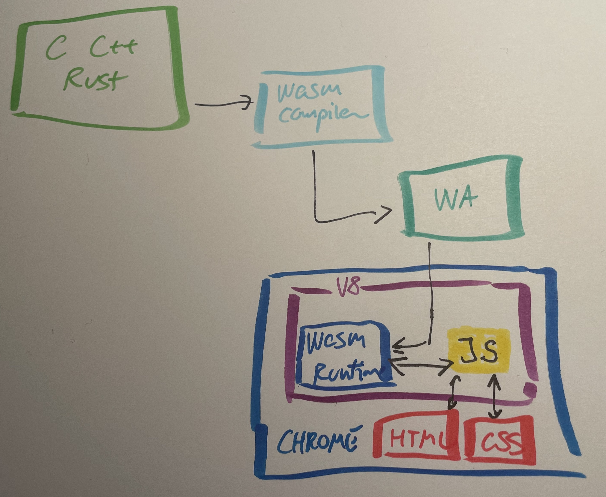

# Hvad er WebAssembly?

WebAssembly - også kaldet wasm - er et binært format beregnet til at blive afviklet i en virtual maskine som enten kan køre i en browser eller på en server. Så wasm er ikke et produkt, men består af en række specifikationer for en virtuel maskine, et binary format og et tekst format.

En af design målene med wasm er, at det skal kunne afvikle kode hurtige end javascript.

Webassembly er opstået som en browser teknologi og er ved at brede sig også til server-side brug.

De fleste moderne browsere understøttet WebAssembly. Se https://webassembly.org/roadmap/

# Agenda

1. WebAssembly i browseren
2. WebAssembly server-side
3. WebAssembly og Docker
4. WebAssembly og Cloud
