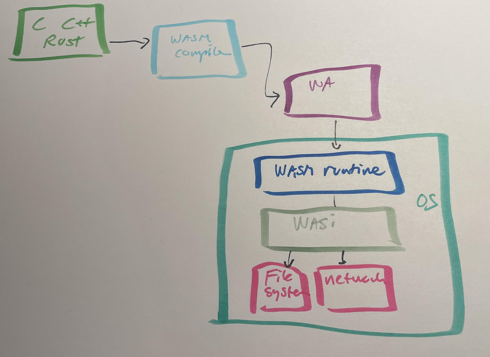

# WebAssembly server-side

Hvad minder wasm udenfor browseren om? Var der nogen som sagde NodeJS?

Der er ikke noget i Wasm specifikationen som binder Wasm til en browser.

Men hvis man kører wasm i en runtime serverside, så skal man tage stilling til, hvordan
OS resourcer skal tilgås.



WASI - WebAssembly System Interface

Som med wasm er WASI en række specifikationer som angiver hvordan man tilgår OS resourcer som fx filer, environment variable, netværk og tid.

Der findes en række runtimes som understøtter Wasm på serveren. Her er en liste over nogle af dem:

- [WasmEdge](https://wasmedge.org/) (CNCF) - [Second State](https://www.secondstate.io/)
- [Wasmtime](https://wasmtime.dev/)
- [wasmer](https://wasmer.io/)

## Demo

Vi genbruger vores Wasm kode fra browseren og kører den server-side med Deno.

```bash
deno run main.ts
```

Deno forhindrer som standard, at man tilgår OS resourcer, med mindre man har givet eksplicit tilladelse til det.

```bash
deno run --allow-read main.ts
```

Alternativ kan vi bruge en wasm runtime direkte:

```bash
wasmtime program.wasm --invoke square 25
```

## Hvorfor er det interessant at køre Wasm på serveren?

- hurtigt - tæt på native performance
- sikkerhed - Wasm er sikkerhedssandboxet
- arkitektur ufhængig
- binær fil som ikke fylder særligt meget

## Fortolkede sprog

Hvad med at køre Wasm på serveren med et fortolket sprog som fx Python eller PHP? Det er fortsat meget eksperimentielt og som jeg forstår det baseret på, at man kompilere kompileren til Wasm.

### Referencer

[Deno](https://deno.land/manual@v1.12.2/getting_started/webassembly)
